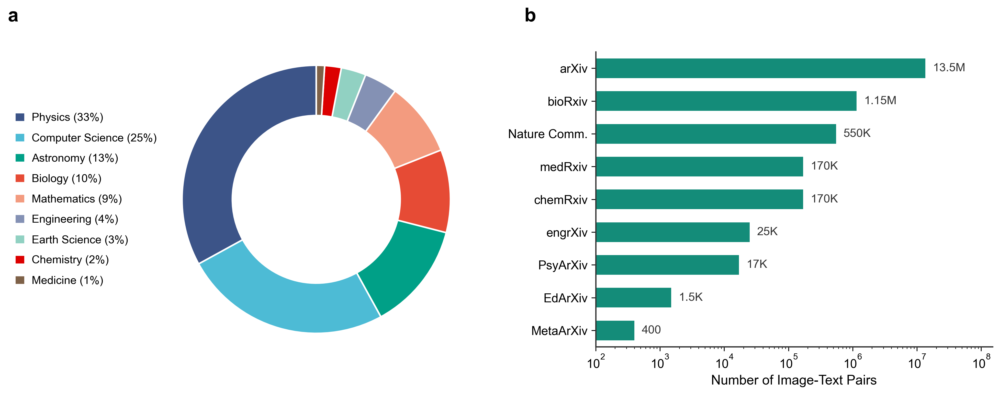

<h1 align="center">🔬 S1-MMAlign: A Large-Scale Multi-Disciplinary Scientific Multimodal Dataset</h1>

<p align="center">
    <a href="https://arxiv.org/abs/2601.00264">
        
    </a>
    <a href="https://huggingface.co/datasets/ScienceOne-AI/S1-MMAlign">
        
    </a>
    <a href="https://github.com/你的github用户名/S1-MMAlign">
        
    </a>
    <a href="#license-and-copyright">
        
    </a>
</p>

> **Bridging the semantic gap in AI for Science:** A massive dataset of 15.5M+ image-text pairs across 9 STEM disciplines, featuring AI-enhanced captions for superior cross-modal alignment.


Multimodal learning has revolutionized general domain tasks, yet its application in scientific discovery is hindered by the profound semantic gap between complex scientific imagery and sparse textual descriptions. 

**S1-MMAlign** aims to bridge this gap. Unlike simple "image-reading," scientific understanding requires traversing multiple semantic layers involving variables, structures, hypotheses, and inferences. This dataset is built to address this "short board" in current data resources.
### Dataset Information

**Total Image-Text Pairs:** > 15,500,000

**Source Papers:** ~ 2,500,000

**Disciplines Covered:** 9 Major STEM Fields

**Alignment Improvement:** +18.21% (CLIP Score vs. Raw Data)

**License:** CC BY-NC 4.0
<p align="center">
  
</p>

### How was the data processed?

To address the pervasive issue of weak alignment in raw scientific captions, we introduced an AI-ready semantic enhancement pipeline. We utilized the **Qwen-VL** multimodal large model series to recaption images by synthesizing context from paper abstracts and citation contexts. 

Technical validation demonstrates significant quality improvements: SciBERT-based pseudo-perplexity metrics show reduced semantic ambiguity, while CLIP scores indicate an **18.21%** improvement in image-text alignment.

**Recommendation: Please use the `recaption` field for model training.**

* **`image_path`**: The relative path to the image file.
* **`recaption`** (Recommended): The **AI-enhanced caption** generated by our pipeline (Qwen-VL). It synthesizes context from the paper abstract and citations to provide a semantically rich description, significantly outperforming the raw caption in alignment and quality.
* **`caption`**: The original, raw caption extracted from the paper figures (often noisy or sparse).
* **`metadata`**: Additional information including source paper arxiv_id and title.


### Note on File Structure

**The relative paths of the images provided in the `jsonl` file must follow the file structure we provide in order to be used correctly.** Please ensure you maintain the directory hierarchy after downloading and decompressing the dataset. Do not flatten the folder structure, as the metadata relies on specific relative paths.

---

### Citation

If you find this dataset useful, please cite our work:

```bibtex
@article{s1mmalign2026,
  title={S1-MMAlign: A Large-Scale, Multi-Disciplinary Dataset for Scientific Figure–Text Understanding},
  author={He Wang and Longteng Guo and Pengkang Huo and Xuanxu Lin and Yichen Yuan and Jie Jiang and Jing Liu},
  journal={ArXiv preprint},
  url={https://arxiv.org/abs/2601.00264}, 
  year={2026}
}
```

### License and Copyright

**This dataset is released under the CC BY-NC 4.0 license for research and non-commercial use only.**

* **Non-Commercial:** Commercial use of the dataset or any images is strictly prohibited.
* **Copyrights:** The images contained in this dataset are extracted from publicly accessible scientific publications. All copyrights of the original figures remain with their original authors or publishers.
* **Compliance:** Users must ensure their use complies with the copyrights of the original publications.
